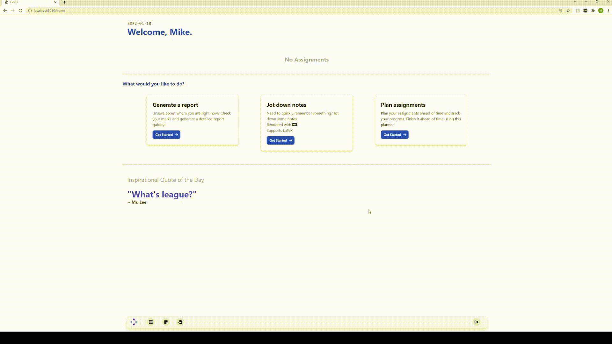

# Gradus

[](https://github.com/yak-fumblepack/Gradus/actions/workflows/build.yml)



A web application that merges note taking, assignments, and autograding into one platform for all students. 

Built with Spring boot as part of my ICS3U1 culminating.

## Running this application

```shell
$ git clone git@github.com:yak-fumblepack/Gradus.git
$ cd gradus
```

Using maven:

```shell
$ mvn spring-boot:run
```

View on [localhost:8080](http://localhost:8080)

# License

This project is licensed under Apache 2.0, refer to [LICENSE](LICENSE) for more details.